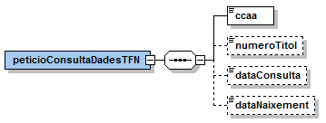
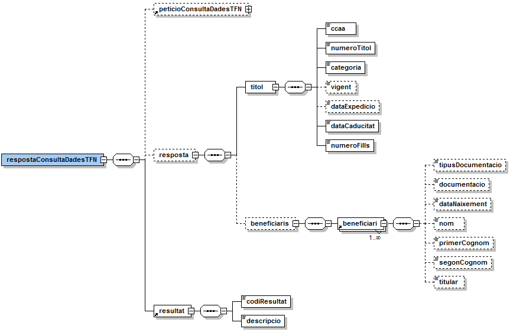

# Via Oberta – TFN (CCAA)	
Document d’integració del servei.

Podreu trobar els XSD's del servei en aquest repositori sota el directori [/schema](https://github.com/ConsorciAOC/VO-TFN_CCAA/tree/main/TFN-CCAA-schema).

## Control del document

### Informació general

| **Títol:** | Via Oberta – TFN Títol de Família Nombrosa (CCAA). Document d’integració del servei|
| --- | --- |
| **Creat per:** | Àrea de Tecnologia - Projectes |
| **A revisar per:** | Àrea de Tecnologia - Suport |
| **A aprovar per:** | Àrea de Tecnologia - Suport|
| **Llista de distribució:** | |
| **Nom del document:** | DI - Via Oberta - TFN-CCAA.doc |

### Històric de revisions

| **Versió** | **Data** | **Autor** | **Comentaris** |
| --- | --- | --- | --- |
| V1.0 | 19/11/2018 | Roger Noguera i Arnau| Creació del document|

### Índex

- [1. Introducció](#1)
- [2. Transmissions de dades disponibles](#2)
- [3. Missatgeria dels serveis](#3)
   * [3.1. Consulta de vigència (TFN_VIGENCIA)](#3.1)
		* [3.1.1 Petició – dades genèriques](#3.1.1)
		* [3.1.2 Petició – dades específiques](#3.1.2)
		* [3.1.3 Resposta – dades específiques](#3.1.3)
- [4. Joc de proves](#4)

## 1 Introducció 
Aquest document detalla la missatgeria associada al servei de consulta de Títols de Família
Nombrosa de la resta de CCAA de l’Estat.

 Per poder realitzar la integració cal conèixer prèviament la següent documentació:

- [Document de Missatgeria Genèrica de la PCI del Consorci AOC.][PCI]

[PCI]:https://github.com/ConsorciAOC/PCI

## 2 Transmissions de dades disponibles 

Les dades disponibles a través del servei són les que es presenten a continuació

- **EMISSOR**: Comunitats autònomes de la resta de l’Estat

| **PRODUCTE** | **MODALITAT** | **DESCRIPCIO** |
| --- | --- | --- |
| **TFN_CCAA**| [TFN_CCAA](#3.1) | Consulta del Títol de Família Nombrosa.|

Les modalitats disposen de versió imprimible del resultat de la consulta en format PDF. Per més detalls adreceu-vos a l’apartat Extensions de missatgeria del document de missatgeria genèrica.

## 3 Missatgeria dels serveis
A continuació es detalla la missatgeria corresponent al bloc de dades específiques de les modalitats de consum del producte.

>:warning: L’emissor de les dades requereix que s’informin les dades del funcionari que realitza la consulta. Així, cal informar els següents camps de l’element Funcionario del bloc de dades genèriques:   /Peticion/Funcionario/NombreCompletoFuncionario,   /Peticion/Funcionario/NifFuncionario,  //SolicitudTransmision/DatosGenericos/Solicitante/Funcionario/NombreCompletoFuncionario   //SolicitudTransmision/DatosGenericos/Solicitante/Funcionario/NifFuncionario

### 3.1 Consulta de títol de família nombrosa (TFN_CCAA) 

#### 3.1.1 Petició – dades genèriques 
| *Element* | *Descripció**|
| --- | --- |
|//DatosGenericos/Titular/TipoDocumentacion|Tipus de documentació (NIF, DNI, NIE,Passaport).|
|//DatosGenericos/Titular/Documentacion|Documentació.|

#### 3.1.2 Petició – dades específiques 

| *Element* | *Descripció**|
| --- | --- |
|/peticioConsultaDadesTFN/ccaa | Codi de comunitat autònoma: 01 - ANDALUCÍA 02 - ARAGÓN 03 - PRINCIPADO DE ASTURIAS 04 - ISLAS BALEARES 05 - CANARIAS 06 - CANTABRIA 07 - CASTILLA y LEÓN 08 - CASTILLA-LA MANCHA 09 - CATALUNYA 10 - COMUNIDAD VALENCIANA 11 - EXTREMADURA 12 - GALICIA 13 - MADRID 14 -REGIÓN DE MURCIA 15 - NAVARRA 16 - PAÍS VASCO 17 - LA RIOJA 18 - CIUDAD DE CEUTA 19 - CIUDAD DE MELILLA |
| /peticioConsultaDadesTFN/numeroTitol  | Número de títol. |
| /peticioConsultaDadesTFN/dataConsulta  | Data sobre la que es realitzarà la consulta (DD/MM/AAAA). |
| /peticioConsultaDadesTFN/dataNaixement | Data de naixement del titular consultat(DD/MM/AAAA).|

#### 3.1.3 Resposta – dades específiques 

| *Element* | *Descripció**|
| --- | --- |
| respostaConsultaDadesTFN/peticioConsultaDadesTFN | Bloc de dades corresponent a la petició que genera la resposta. |
| respostaConsultaDadesTFN/resposta  | Bloc de dades corresponent a la resposta. |
| //resposta/titol | Bloc de dades corresponent al títol de família nombrosa del titular consultat. |
| //titol/ccaa  | Codi de comunitat autònoma. |
| //titol/numeroTitol | Número del títol de família nombrosa |
| //titol/categoria | Categoria del títol: <ul><li><i>G</i> (General)</li><li><i>E</i>(Especial)</li><li><i>P</i> (Primera)</li><li><i>S</i> (Segona)</li><li><i>H</i> (d'honor)</li></ul> G i E pertanyen a títols anteriors a 2013| 
| //titol/vigent  | Indica si el títol està vigent a data de consulta (S/N) |
| //titol/dataExpedicio | Data d’expedició del títol (DD/MM/AAAA). |
| //titol/dataCaducitat  | Data de caducitat del títol (DD/MM/AAAA). |
| //titol/numeroFills | Número de fills que té el titular del títol. |
| //resposta/titol/beneficiaris  | Bloc de dades corresponent al llistat de beneficiaris del títol. |
| //beneficiaris/beneficiari  | Bloc de dades corresponent a un beneficiari del títol. |
| //beneficiari/tipusDocumentacio  | Tipus de documentació: <i>NIF, DNI, NIE, Pasaporte</i> |
| //beneficiari/documentació  | Documentació del beneficiari. |
| //beneficiari/dataNaixement  | Data de naixement del beneficiar |
| //beneficiari/primerCognom | Primer cognom del beneficiari. |
| //beneficiari/segonCognom  | Segon cognom del beneficiari |
| //beneficiari/titular | És el titular? (S/N) |
| respostaConsultaDadesTFN/resultat/codiResultat| <ul><li>0: <i>existeix el títol.</i></li><li>1: <i> no hi ha enregistrat un titular o beneficiari de família nombrosa amb les dades indicades. </i></li><li>2: <i>no existeix el títol de família nombrosa indicat. </i></li><li>3: <i>la persona no està associada al títol de família nombrosa indicat. </i></li><li>4: <i>format de títol incorrecte. </i></li><li>5: <i>amb les dades facilitades existeix més d’un titular o beneficiari d’un títol de família nombrosa </i></li><li>6: <i>títol de família nombrosa caducat</li><li>7: <i>a la data indicada, la persona consultada no es beneficiaria de títol de família nombrosa. </i></li><li>8: <i>consulta per data no disponible</li><li>9: <i> consulta per número de títol no disponible.</li><li>0502: <i>error realitzant la consulta.</li></ul> |
| respostaConsultaDadesTFN/resultat/descripcio| Descripció del resultat. |

# 4 Joc de proves 

https://administracionelectronica.gob.es/ctt/svd/descargas#.YvOZNXbP2Ul

L&#39;emissor final publica els següent [joc de proves a l&#39;entorn de pre-producció][proves] 

[proves]: https://administracionelectronica.gob.es/ctt/svd/descargas#.YvOZNXbP2Ul
 En cas de tindre problemes per accedir als jocs de proves, si us plau, obre un tiquet a través del [formulari][form]

[form]:https://www.aoc.cat/portal-suport/peticio-integradors/idservei/integracio/
